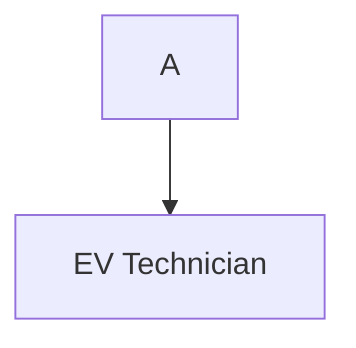

## EV Technician
EV Technician (ช่างเทคนิคยานยนต์ไฟฟ้า) คือผู้เชี่ยวชาญด้านการตรวจสอบ วิเคราะห์ปัญหา ซ่อมแซม และบำรุงรักษารถยนต์ไฟฟ้า ทั้งระบบไฟฟ้า แบตเตอรี่ และมอเตอร์ 
โดยใช้เครื่องมือวิเคราะห์คอมพิวเตอร์ขั้นสูง เป็นสายงานที่ต้องการมากในศูนย์บริการและโรงงานผลิต EV ปัจจุบันเงินเดือนเฉลี่ยเริ่มต้นประมาณ 15,000 - 22,000+ บาท ขึ้นอยู่กับประสบการณ์ 
